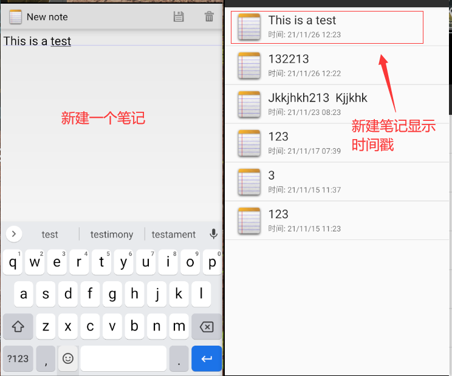
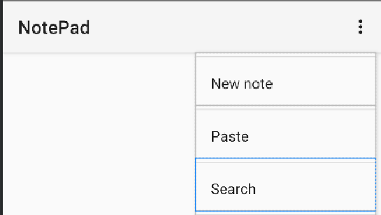
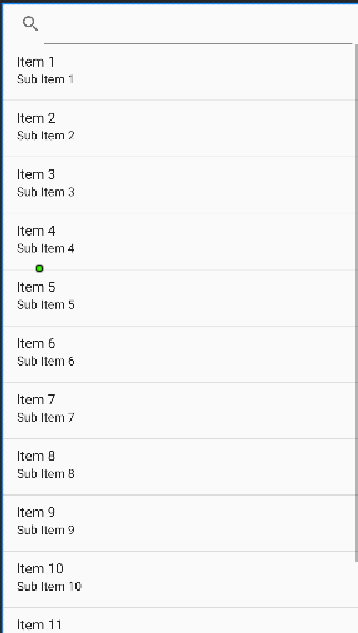
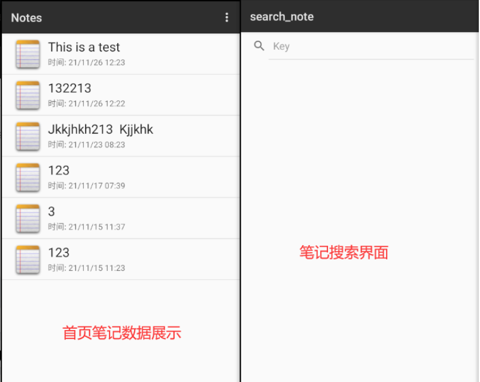
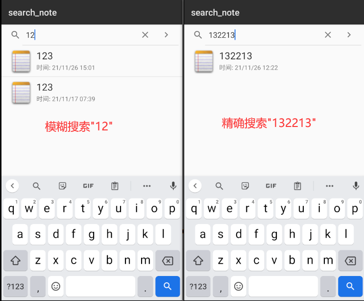
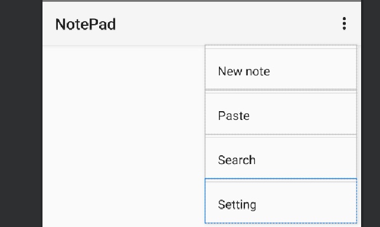
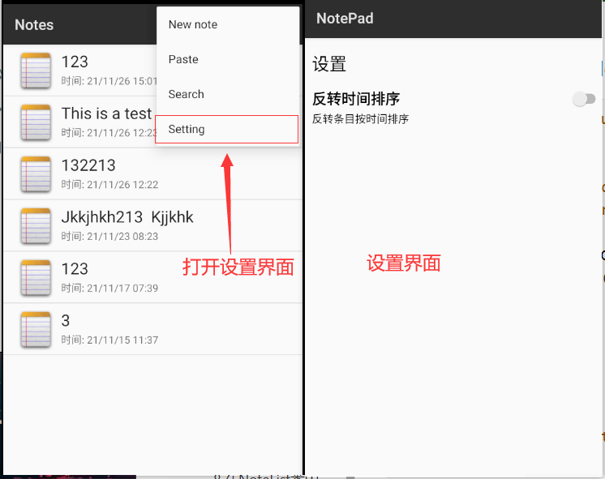
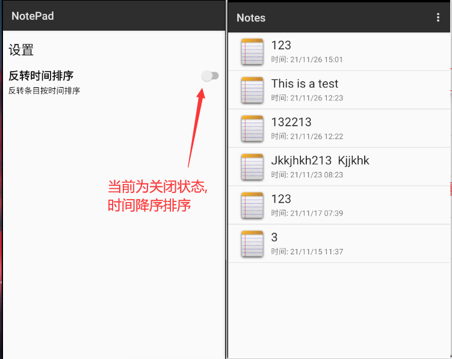
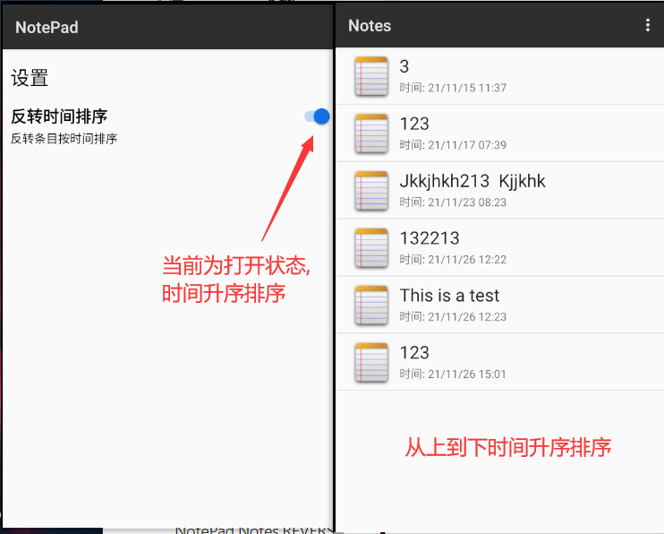

# Android期中实验-NotePad记事本应用

​                                            																	**116052019001 许潇**

## 项目结构介绍

**主要的类:**
NotesList类 应用程序的入口，笔记本的首页面会显示笔记的列表
NoteEditor类 编辑笔记内容的Activity
TitleEditor类 编辑笔记标题的Activity
NoteSearch类 编辑查询笔记内容的Activity
NotePadProvider 这是笔记本应用的ContentProvider
NoteSetting 这是笔记本设置的Activity

**布局文件：**
note_editor.xml 笔记主页面布局
note_search.xml 笔记内容查询布局
noteslist_item.xml 笔记主页面每条笔记的布局
title_editor.xml 修改笔记主题布局
notelist_setting 笔记设置界面布局

**菜单文件：**
editor_options_menu.xml 编辑笔记内容的菜单布局
list_context_menu.xml 笔记内容编辑上下文菜单布局
list_options_menu.xml 笔记主页面可选菜单布局

## 基本功能

### ①添加笔记时间戳

#### 1.在主界面每个列表项的布局文件(noteslist_item.xml)中添加时间戳

```xml
<TextView
          android:id="@android:id/text2"
          android:layout_width="match_parent"
          android:layout_height="25dp"
          android:singleLine="true"
          android:text="时间:" />
```

#### 2.在NoteList类中的PROJECTION中添加COLUMN_NAME_MODIFICATION_DATE字段

COLUMN_NAME_MODIFICATION_DATE字段在NotePad.java中的说明

```java
/**
* Column name for the modification timestamp
* <P>Type: INTEGER (long from System.curentTimeMillis())</P>
*/
public static final String COLUMN_NAME_MODIFICATION_DATE = "modified";
```

添加字段后的PROJECTION

```java
/**
* The columns needed by the cursor adapter
*/
private static final String[] PROJECTION = new String[] {
    NotePad.Notes._ID, // 0
    NotePad.Notes.COLUMN_NAME_TITLE, // 1
    NotePad.Notes.COLUMN_NAME_MODIFICATION_DATE, //加入了修改时间的显示
};
```

#### 3.修改适配器内容，增加dataColumns中装配到ListView的内容,同时增加一个ID标识来存放该时间参数。

```java
// The names of the cursor columns to display in the view, initialized to the title column
String[] dataColumns = { NotePad.Notes.COLUMN_NAME_TITLE,
                NotePad.Notes.COLUMN_NAME_MODIFICATION_DATE } ;

// The view IDs that will display the cursor columns, initialized to the TextView in
int[] viewIDs = { android.R.id.text1 ,android.R.id.text2};
```

#### 4.在NoteEditor类的updateNote方法中获取当前系统的时间，并对时间进行格式化,新建笔记时添加时间戳数据

```java
// Sets up a map to contain values to be updated in the provider.
ContentValues values = new ContentValues();
// 获取当前手机时间转化时间格式
Long now = Long.valueOf(System.currentTimeMillis());
SimpleDateFormat sf = new SimpleDateFormat("yy/MM/dd HH:mm");
Date d = new Date(now);
String format = sf.format(d);

values.put(NotePad.Notes.COLUMN_NAME_MODIFICATION_DATE, "时间: "+format);// System.currentTimeMillis());
```

#### 5.成果展示



### ②笔记查询功能

#### 1.将搜索菜单项放在主页面的菜单选项中，在list_options_menu.xml布局文件中添加搜索功能

```xml
<item
        android:id="@+id/menu_search"
        android:icon="@android:drawable/ic_menu_search"
        android:title="@string/menu_search"/>
```



#### 2.新建一个查找笔记的布局文件notelist_search.xml

```xml
<?xml version="1.0" encoding="utf-8"?>
<LinearLayout xmlns:android="http://schemas.android.com/apk/res/android"
    android:layout_width="match_parent"
    android:layout_height="match_parent"
    android:orientation="vertical">
    <SearchView
        android:id="@+id/search_view"
        android:layout_width="match_parent"
        android:layout_height="wrap_content"
        android:iconifiedByDefault="false"
        />
    <ListView
        android:id="@+id/list_view"
        android:layout_width="match_parent"
        android:layout_height="wrap_content"
        />
</LinearLayout>
```



#### 3.在NoteList类中的onOptionsItemSelected方法中添加search查询activity的跳转

```java
case R.id.menu_search:
//查找笔记功能界面跳转
	Intent intent = new Intent(this, NoteSearch.class);
	this.startActivity(intent);
	return true;
```

#### 4.新建NoteSearch类实现笔记查找功能启动Acticity

```java
package com.example.android.notepad;
import android.app.Activity;
import android.content.Intent;
import android.database.Cursor;
import android.database.sqlite.SQLiteDatabase;
import android.os.Bundle;
import android.widget.ListView;
import android.widget.SearchView;
import android.widget.SimpleCursorAdapter;
import android.widget.Toast;

public class NoteSearch extends Activity implements SearchView.OnQueryTextListener
{
    ListView listView;
    SQLiteDatabase sqLiteDatabase;

    private static final String[] PROJECTION = new String[]{
            NotePad.Notes._ID, // 0
            NotePad.Notes.COLUMN_NAME_TITLE, // 1
            NotePad.Notes.COLUMN_NAME_MODIFICATION_DATE// 时间戳
    };

    public boolean onQueryTextSubmit(String query) {
        Toast.makeText(this, "搜索结果："+query, Toast.LENGTH_SHORT).show();
        return false;
    }

    @Override
    protected void onCreate(Bundle savedInstanceState) {
        super.onCreate(savedInstanceState);
        setContentView(R.layout.notelist_search);
        SearchView searchView = findViewById(R.id.search_view);
        Intent intent = getIntent();
        if (intent.getData() == null) {
            intent.setData(NotePad.Notes.CONTENT_URI);
        }
        listView = findViewById(R.id.list_view);
        sqLiteDatabase = new NotePadProvider.DatabaseHelper(this).getReadableDatabase();
        //设置该SearchView显示搜索按钮
        searchView.setSubmitButtonEnabled(true);

        //设置该SearchView内默认显示的提示文本
        searchView.setQueryHint("Key");
        searchView.setOnQueryTextListener(this);

    }
    public boolean onQueryTextChange(String string) {
        String selection1 = NotePad.Notes.COLUMN_NAME_TITLE+" like ? or "+NotePad.Notes.COLUMN_NAME_NOTE+" like ?";
        String[] selection2 = {"%"+string+"%","%"+string+"%"};
        Cursor cursor = sqLiteDatabase.query(
                NotePad.Notes.TABLE_NAME,
                PROJECTION,
                selection1,
                selection2,
                null,
                null,
                NotePad.Notes.DEFAULT_SORT_ORDER
        );
        String[] dataColumns = {
                NotePad.Notes.COLUMN_NAME_TITLE,
                NotePad.Notes.COLUMN_NAME_MODIFICATION_DATE
        } ;

        int[] viewIDs = {
                android.R.id.text1,
                android.R.id.text2
        };
        SimpleCursorAdapter adapter
                = new SimpleCursorAdapter(
                this,                             // The Context for the ListView
                R.layout.noteslist_item,         // Points to the XML for a list item
                cursor,                           // The cursor to get items from
                dataColumns,
                viewIDs
        );
        listView.setAdapter(adapter);
        return true;
    }
}

```

#### 5.AndroidManifest.xml清单文件中添加NoteSearch

```xml
<activity
            android:name=".NoteSearch"
            android:label="search_note" />
```

#### 6.成果展示





## 拓展功能

### ①反转时间排序

#### 1.将设置菜单项放在主界面的菜单选项中,在list_options_menu.xml布局文件中添加设置功能

```xml
<item
        android:id="@+id/menu_setting"
        android:icon="@android:drawable/ic_menu_search"
        android:title="@string/menu_setting"/>
```



#### 2.新建一个设置界面的布局文件notelist_setting.xml

```xml
<?xml version="1.0" encoding="utf-8"?>
<LinearLayout xmlns:android="http://schemas.android.com/apk/res/android"
    xmlns:app="http://schemas.android.com/apk/res-auto"
    xmlns:tools="http://schemas.android.com/tools"
    android:orientation="vertical"
    android:layout_width="match_parent"
    android:layout_height="match_parent">
    <LinearLayout
        android:layout_width="match_parent"
        android:layout_height="wrap_content"
        android:focusable="true"
        android:focusableInTouchMode="true"
        android:clickable="true"
        android:orientation="vertical"
        >

        <LinearLayout
            android:layout_width="match_parent"
            android:layout_height="70dp"
            android:orientation="horizontal">

            <TextView
                android:id="@+id/setting_settings_text"
                android:layout_width="wrap_content"
                android:layout_height="wrap_content"
                android:layout_gravity="center"
                android:layout_marginLeft="10dp"
                android:layout_weight="1"
                android:autoLink="all"
                android:text="设置                    "
                android:textColor="@color/black"
                android:textSize="24dp" />

        </LinearLayout>

        <LinearLayout
            android:layout_width="match_parent"
            android:layout_height="54dp"
            android:clickable="true"
            android:focusable="true"
            android:focusableInTouchMode="true"
            android:orientation="horizontal">

            <LinearLayout
                android:layout_width="164dp"
                android:layout_height="54dp"
                android:clickable="true"
                android:focusable="true"
                android:focusableInTouchMode="true"
                android:orientation="vertical">

                <TextView
                    android:id="@+id/orderbytime"
                    android:layout_width="wrap_content"
                    android:layout_height="wrap_content"
                    android:layout_marginLeft="10dp"
                    android:layout_weight="1"
                    android:text="反转时间排序"
                    android:textColor="@color/black"
                    android:textSize="20dp"
                    android:textStyle="bold" />


                <TextView
                    android:id="@+id/orderbytimetip"
                    android:layout_width="wrap_content"
                    android:layout_height="wrap_content"

                    android:layout_marginLeft="10dp"
                    android:layout_weight="1"
                    android:text="反转条目按时间排序"
                    android:textColor="@color/black"
                    android:textSize="15dp" />
            </LinearLayout>

            <Switch
                android:id="@+id/orderbytime_switch"
                android:layout_width="0dp"
                android:layout_height="wrap_content"
                android:layout_weight="1"
                android:checked="false"
                android:gravity="center_vertical"
                tools:checked="false" />

        </LinearLayout>

    </LinearLayout>

</LinearLayout>
```

**其中switch控件为控制反转时间排序功能的开关**


#### 3.在NoteList类中的onOptionsItemSelected方法中添加setting设置activity的跳转

```java
case R.id.menu_setting:
    //设置界面的跳转
    Intent intent_set = new Intent(this, NoteSetting.class);
    this.startActivity(intent_set);
    return true;
```

#### 4.新建NoteSetting类实现笔记本设置功能启动Acticity

```java
package com.example.android.notepad;

import static android.content.ContentValues.TAG;

import android.app.Activity;
import android.content.Intent;
import android.content.SharedPreferences;
import android.os.Bundle;
import android.util.Log;
import android.widget.CompoundButton;
import android.widget.Switch;

public class NoteSetting extends Activity {

    @Override
    protected void onCreate(Bundle savedInstanceState) {
        super.onCreate(savedInstanceState);
        setContentView(R.layout.notelist_setting);

        loadSwitchState();  //加载switch控件当前状态
		
        Switch reversal_switch = (Switch) findViewById(R.id.orderbytime_switch);
        // 添加监听 当switch控件状态发生转变时触发
        reversal_switch.setOnCheckedChangeListener(new CompoundButton.OnCheckedChangeListener() {
            @Override
            public void onCheckedChanged(CompoundButton buttonView, boolean isChecked) {
                if (isChecked){
                    Log.d(TAG, "switch be open");
                    setisReversal(true);
                    returnToMain();
                }else {
                    Log.d(TAG, "switch be close");
                    setisReversal(false);
                    returnToMain();
                }
            }
        });
    }

    private void returnToMain(){
        Intent intent = new Intent(this, NotesList.class);
        startActivity(intent);
    }

    private void loadSwitchState(){
        //从SharedPreference中读取并加载switch状态
        SharedPreferences settings
                = this.getSharedPreferences("Setting", MODE_PRIVATE);
        SharedPreferences.Editor editor = settings.edit();
        Switch reversal_switch = (Switch) findViewById(R.id.orderbytime_switch);
        boolean reversal_state = settings.getBoolean("order_reversal", false);
        reversal_switch.setChecked(reversal_state);
    }

    private void setisReversal(boolean flag) {
        //根据flag保存当前switch控件的状态到SharedPreference
        SharedPreferences settings
                = this.getSharedPreferences("Setting", MODE_PRIVATE);
        SharedPreferences.Editor editor = settings.edit();
        editor.putBoolean("order_reversal", flag);
        editor.commit();
    }

}
```

#### 5.在NoteList类中添加获取switch控件的状态(是否打开时间反转排序)

```java
private boolean getSwitchState() {
    //从SharedPreferences中得到当前是否时间反转排序(switch控件状态)
    SharedPreferences settings
            = this.getSharedPreferences("Setting", MODE_PRIVATE);
    //加载switch状态
    boolean reversal_state = settings.getBoolean("order_reversal", false);

    return reversal_state;
}
```

#### 6.在NotePad.java中的Notes类中添加静态字符常量

其中字符常量DEFAULT_SORT_ORDER为源码自带

而字符常量**REVERSAL_SORT_ORDER**为个人添加

```java
/**
 * The default sort order for this table
 */
public static final String DEFAULT_SORT_ORDER = "modified DESC";
public static final String REVERSAL_SORT_ORDER = "modified ASC";
```

#### 7.在NoteList类中添加字符数组常量NotePad.Notes.REVERSAL_SORT_ORDER

```java
//排列顺序
private static final String[] ORDER = new String[]{
        NotePad.Notes.DEFAULT_SORT_ORDER, //按默认时间降序排序
        NotePad.Notes.REVERSAL_SORT_ORDER //颠倒排序,按时间升序排序
};
```

#### 8.在NoteList类中添加获取switch开关控件状态的代码

```java
//获取当前switch控件状态
boolean state = getSwitchState();
//orderstate储存状态
String orderstate;
if(state == false){
    orderstate = ORDER[0]; //默认时间降序
}
else{
    orderstate = ORDER[1]; //颠倒排序,时间升序
}
```

#### 9.将cursor中的改为orderstate后反转时间排序功能完成

```java
/* Performs a managed query. The Activity handles closing and requerying the cursor
 * when needed.
 * Please see the introductory note about performing provider operations on the UI thread.
 */
Cursor cursor = managedQuery(
    getIntent().getData(), // Use the default content URI for the provider.
    PROJECTION,            // Return the note ID and title for each note.
    null,                  // No where clause, return all records.
    null,                  // No where clause, therefore no where column values.
    orderstate  // Use the sort order by SharedPreferences.
);
```

#### 10.成果展示






